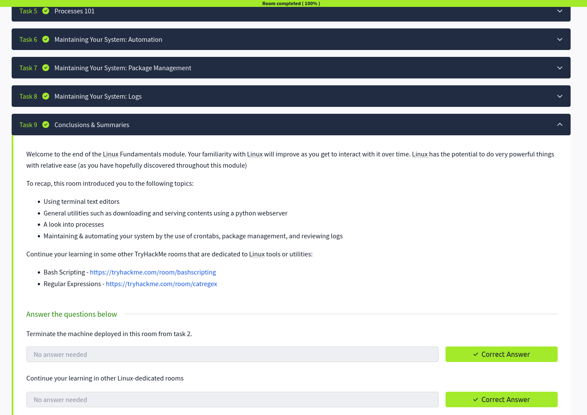

# 🐧 Linux Fundamentals – Part 3 Notes

## Why Linux Fundamentals 3 Matters
- Builds advanced Linux operational skills  
- Focuses on system management and automation  
- Introduces processes, logs, and package management  
- Essential for cybersecurity, DevOps, and system administration  

---

## Terminal Text Editor

- Text editors are used to create and modify files directly in the terminal  
- Common editors: nano, vim  

nano file.txt

- Simple and beginner-friendly editor  
- Used for quick file editing in Linux  

---

## General / Useful Utilities

- Linux provides many built-in tools for system operations  

whoami      → Show current user  
uname -a    → Show system information  
history     → Show command history  
clear       → Clear terminal screen  
date        → Show system date and time  

- These commands help with system awareness and navigation  

---

## Processes 101

- A process is a running program in Linux  
- Each process has a unique Process ID (PID)  

ps          → Show running processes  
top         → Real-time process monitoring  
kill PID    → Terminate a process  

- Used to manage system performance and control running applications  

---

## Maintaining Your System: Automation

- Automation helps schedule tasks in Linux  
- Done using cron jobs  

crontab -e

- Used to schedule scripts or commands to run automatically  
- Common in backups, monitoring, and system maintenance  

---

## Maintaining Your System: Package Management

- Package managers install, update, and remove software  

Debian/Ubuntu:
apt update
apt install package_name

- Ensures software is up to date and secure  
- Critical for system maintenance and security patches  

---

## Maintaining Your System: Logs

- Logs store system activity and events  
- Useful for troubleshooting and security analysis  

/var/log/

Common logs:
- auth.log → authentication logs  
- syslog → system logs  
- kern.log → kernel logs  

- Logs are essential for incident investigation  

---

## Key Takeaways

- Terminal editors allow file creation and modification  
- Utilities help manage and inspect the system  
- Processes must be monitored and controlled  
- Automation improves efficiency using cron jobs  
- Package management keeps systems updated  
- Logs are critical for troubleshooting and security  

---

## Screenshot

> Screenshot shows completion of Linux Fundamentals Part 3 on TryHackMe  

---

## Final Conclusion
Linux Fundamentals 3 completes the core foundation by introducing system management, automation, and process control — essential skills for real-world cybersecurity environments.
