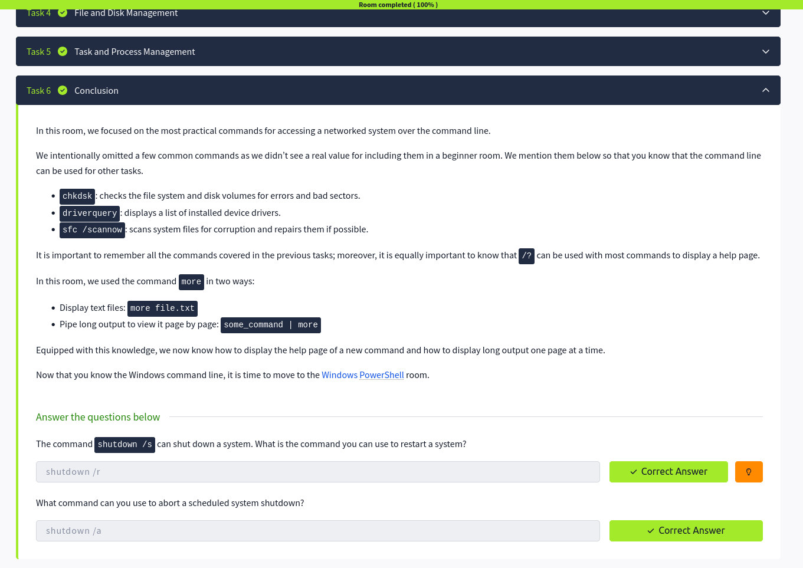

# 💻 Windows Command Line – Notes

## Introduction
- The Windows Command Line is a text-based interface used to interact with the operating system  
- It allows users to run commands without a graphical interface  
- Common tools include CMD (Command Prompt)  

---

## Basic System Information

- Used to view system details and environment information  

systeminfo      → Displays detailed system information  
hostname        → Shows computer name  
ver             → Shows Windows version  
echo %username% → Shows current logged-in user  

- Helps in system analysis and troubleshooting  

---

## Network Troubleshooting

- Used to diagnose and test network connectivity  

ipconfig        → Shows IP configuration  
ipconfig /all   → Detailed network information  
ping host       → Tests connectivity to a host  
tracert host    → Shows route packets take to destination  

- Useful for identifying network issues and connectivity problems  

---

## File and Disk Management

- Used to manage files, folders, and storage  

dir             → Lists files and folders  
cd              → Change directory  
mkdir           → Create folder  
del file        → Delete file  
copy file1 file2 → Copy files  
move file1 file2 → Move or rename files  

- Helps manage system storage and file structure  

---

## Task and Process Management

- Used to monitor and control running processes  

tasklist        → Shows running processes  
taskkill /PID   → Terminates a process by ID  
taskkill /IM    → Terminates a process by name  

- Important for performance monitoring and stopping unwanted processes  

---

## Key Takeaways

- Command Line allows direct system interaction  
- System info commands help identify device details  
- Network tools assist in troubleshooting connectivity  
- File management commands control data organization  
- Task management helps control running applications  

---

## Screenshot

> Screenshot shows completion of Windows Command Line Room on TryHackMe  

---

## Next: Windows PowerShell
