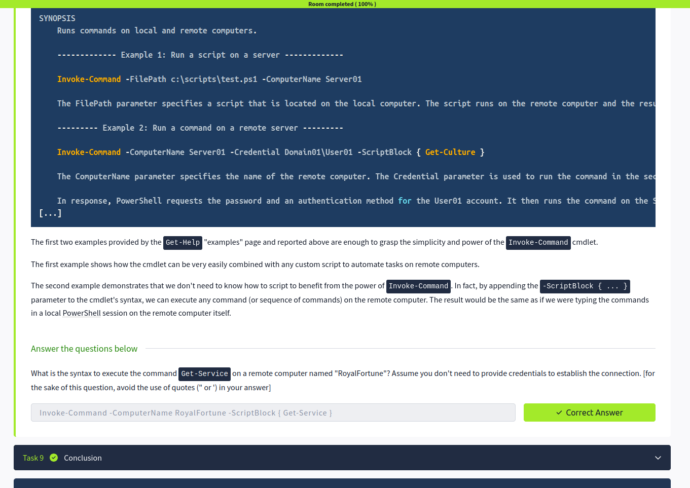

# 💻 Windows PowerShell – Notes

## Introduction
PowerShell is a command-line shell and scripting language used for system administration, automation, and advanced configuration in Windows environments. It is more powerful than CMD because it works with objects instead of plain text.

---

## What is PowerShell
PowerShell is developed by Microsoft and designed for managing Windows systems efficiently. It uses cmdlets which follow a Verb-Noun structure and supports scripting using .ps1 files.

---

## PowerShell Basics
Get-Help command → shows help information  
Get-Command → lists all available commands  
Get-Process → shows running processes  
Get-Service → displays system services  

PowerShell commands are structured and return objects, not just text output.

---

## Navigating the File System and Working with Files
Get-Location → shows current directory  
Set-Location path → changes directory  
Get-ChildItem → lists files and folders  
New-Item file.txt → creates a file or folder  
Remove-Item file.txt → deletes a file  

These commands are used to manage files and navigate the system.

---

## Piping, Filtering and Sorting Data
PowerShell uses pipes (|) to pass output between commands:

Get-Process | Sort-Object CPU  
Get-Service | Where-Object {$_.Status -eq "Running"}  
Get-ChildItem | Select-Object Name  

Piping allows filtering, sorting, and processing data efficiently.

---

## System and Network Information
Get-ComputerInfo → shows full system details  
ipconfig → displays network configuration  
Test-Connection host → checks network connectivity  

These commands are used for system and network diagnostics.

---

## Real-Time System Analysis
Get-Process → monitors running processes  
Get-Service → monitors system services  

These commands help track system performance and active services in real time.

---

## Scripting
PowerShell supports automation using scripts (.ps1 files).

Example script:
Get-Process  
Get-Service  

Scripts are used to automate repetitive tasks and system administration processes.

---

## Key Takeaways
PowerShell is more advanced than CMD and is widely used in system administration and cybersecurity. It supports automation, object-based output, and powerful scripting capabilities. Mastering PowerShell improves efficiency in Windows environments.

---

## Screenshot

> Screenshot shows completion of Windows PowerShell Room on TryHackMe

---

## Next: Linux Shells
