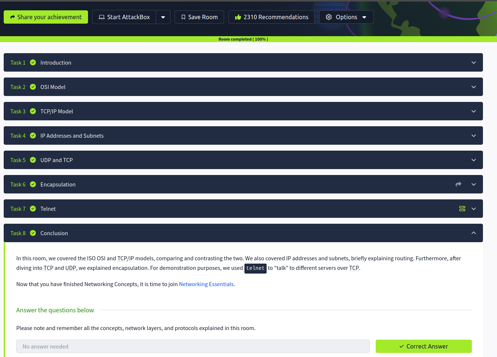

# 🌐 Networking Concepts – Notes

## Introduction
Networking is the foundation of communication between devices and systems. Understanding networking concepts is essential for cybersecurity, system administration, and troubleshooting.

---

## OSI Model
The OSI (Open Systems Interconnection) model is a conceptual framework that explains how data moves across a network through seven layers.

### OSI Layers
1. Physical Layer → Handles hardware and signal transmission  
2. Data Link Layer → Manages MAC addresses and switching  
3. Network Layer → Handles IP addressing and routing  
4. Transport Layer → Ensures reliable data transport  
5. Session Layer → Manages communication sessions  
6. Presentation Layer → Data formatting and encryption  
7. Application Layer → User interaction with network services  

- Helps standardize network communication  
- Useful for troubleshooting network issues  

---

## TCP/IP Model
The TCP/IP model is the practical networking model used on the internet.

### TCP/IP Layers
- Application Layer  
- Transport Layer  
- Internet Layer  
- Network Access Layer  

- Simpler than the OSI model  
- Used in real-world networking environments  

---

## IP Address and Subnet
An IP address uniquely identifies a device on a network.

### Types of IP Addresses
- Private IP → Used inside local networks  
- Public IP → Used on the internet  

### Subnetting
- Divides networks into smaller sections  
- Improves organization and efficiency  

Example:
192.168.1.0/24

- `/24` represents the subnet mask  

---

## UDP and TCP

### TCP (Transmission Control Protocol)
- Reliable connection-oriented protocol  
- Ensures data delivery and ordering  

### UDP (User Datagram Protocol)
- Faster connectionless protocol  
- No guarantee of delivery  

Examples:
- TCP → Web browsing, file transfer  
- UDP → Streaming, gaming, VoIP  

---

## Encapsulation
Encapsulation is the process of adding headers and information to data as it moves through network layers.

### Process
- Data  
- Segment  
- Packet  
- Frame  
- Bits  

- Each layer adds its own information  
- Helps data travel correctly across networks  

---

## Telnet
Telnet is a protocol used for remote command-line access to devices.

telnet IP_address

- Sends data in plain text  
- Insecure compared to SSH  
- Mostly replaced by SSH in modern environments  

---

## Key Takeaways
- The OSI and TCP/IP models explain network communication  
- IP addresses identify devices on networks  
- TCP is reliable while UDP is faster  
- Encapsulation organizes data during transmission  
- Telnet provides remote access but lacks security  

---

## Screenshot

> Screenshot shows completion of Networking Concepts Room on TryHackMe

---

## Next: Networking Essentials
