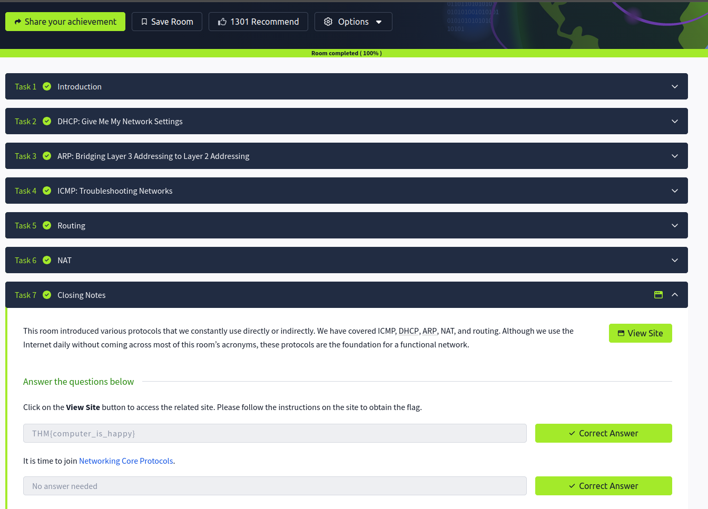

# 🌐 Network Essentials – Notes

## Introduction
Network Essentials covers the core protocols and mechanisms that allow devices to communicate across local and global networks. Understanding these concepts is important for troubleshooting, system administration, and cybersecurity.

---

## DHCP: Give Me My Network Settings
DHCP (Dynamic Host Configuration Protocol) automatically assigns network settings to devices.

### DHCP provides:
- IP address  
- Subnet mask  
- Default gateway  
- DNS server  

- Eliminates manual IP configuration  
- Simplifies network management  

### DHCP Process
1. Discover  
2. Offer  
3. Request  
4. Acknowledge  

This process is commonly called DORA.

---

## ARP: Bridging Layer 3 Addressing to Layer 2 Addressing
ARP (Address Resolution Protocol) maps IP addresses to MAC addresses within a local network.

### Purpose of ARP
- Converts Layer 3 IP addresses into Layer 2 MAC addresses  
- Allows devices to locate each other on the same network  

Example:
- Device knows IP address  
- ARP discovers corresponding MAC address  

- Essential for local network communication  

---

## ICMP: Troubleshooting Networks
ICMP (Internet Control Message Protocol) is used for diagnostics and error reporting in networks.

### Common ICMP Tools
ping → tests connectivity  
tracert / traceroute → shows packet route  

- Helps identify unreachable systems and network issues  
- Commonly used in troubleshooting and monitoring  

---

## Routing
Routing determines how packets travel between different networks.

### Routers:
- Forward packets between networks  
- Use routing tables to determine paths  

### Types of Routing
- Static routing  
- Dynamic routing  

- Essential for internet communication and network segmentation  

---

## NAT
NAT (Network Address Translation) translates private IP addresses into public IP addresses.

### Benefits of NAT
- Conserves public IP addresses  
- Adds a layer of privacy/security  
- Allows multiple devices to share one public IP  

### Common Types
- Static NAT  
- Dynamic NAT  
- PAT (Port Address Translation)  

- Widely used in home and enterprise networks  

---

## Key Takeaways
- DHCP automatically assigns network settings  
- ARP connects IP addresses to MAC addresses  
- ICMP is essential for network troubleshooting  
- Routing controls packet movement across networks  
- NAT enables private devices to access the internet securely  

---

## Screenshot

> Screenshot shows completion of Network Essentials Room on TryHackMe

---

## Next: Networking Core Protocols
