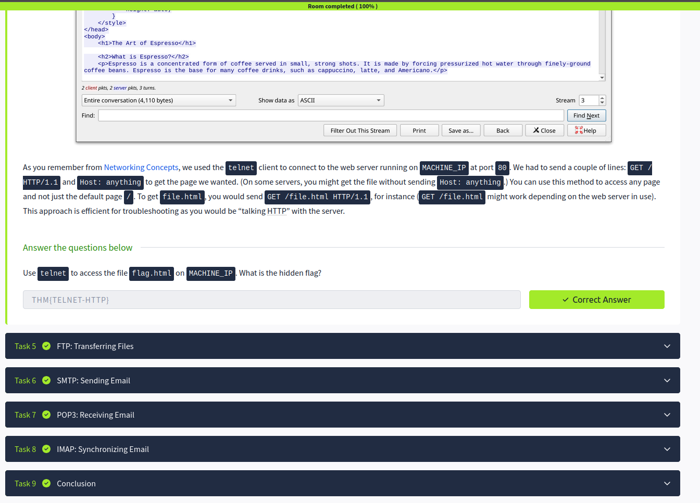

# 🌐 Networking Core Protocols – Notes

## Introduction
Networking protocols define the rules that allow devices and services to communicate across networks. Understanding these protocols is essential for web communication, file transfers, email services, and cybersecurity analysis.

---

## DNS: Remembering Addresses
DNS (Domain Name System) translates domain names into IP addresses.

### Example
google.com → 142.250.x.x

- Makes websites easier to remember  
- Acts like the internet’s phonebook  
- Essential for accessing online services  

### Common DNS Record Types
- A Record → Maps domain to IPv4 address  
- AAAA Record → Maps domain to IPv6 address  
- MX Record → Mail server records  
- CNAME → Alias for another domain  

---

## WHOIS
WHOIS is a protocol used to retrieve information about domain registration.

### Information obtained from WHOIS
- Domain owner  
- Registrar information  
- Registration dates  
- Name servers  

- Useful in cybersecurity investigations and reconnaissance  

---

## HTTP(S): Accessing the Web

### HTTP (HyperText Transfer Protocol)
- Used for web communication  
- Transfers web pages between client and server  
- Data is sent in plain text  

### HTTPS (HTTP Secure)
- Encrypted version of HTTP using SSL/TLS  
- Protects confidentiality and integrity of data  

### Common Ports
- HTTP → Port 80  
- HTTPS → Port 443  

- HTTPS is essential for secure web browsing  

---

## FTP: Transferring Files
FTP (File Transfer Protocol) is used to transfer files between systems over a network.

### Common FTP Commands
get → download file  
put → upload file  
ls → list files  

### Common Ports
- FTP → Port 21  

- Used for file sharing and server management  
- Traditional FTP is not encrypted  

---

## SMTP: Sending Emails
SMTP (Simple Mail Transfer Protocol) is used to send emails between servers and clients.

### Common Port
- SMTP → Port 25  

- Responsible for outgoing email delivery  
- Works together with POP3 or IMAP for complete email communication  

---

## POP3: Receiving Emails
POP3 (Post Office Protocol v3) downloads emails from a server to a local device.

### Characteristics
- Emails are usually removed from the server after download  
- Simple and lightweight protocol  

### Common Port
- POP3 → Port 110  

- Useful for single-device email access  

---

## IMAP: Synchronizing Emails
IMAP (Internet Message Access Protocol) synchronizes emails across multiple devices.

### Characteristics
- Emails remain stored on the server  
- Allows access from multiple devices simultaneously  

### Common Port
- IMAP → Port 143  

- Preferred in modern email systems  

---

## Key Takeaways
- DNS translates domain names into IP addresses  
- WHOIS provides domain registration information  
- HTTP and HTTPS enable web communication  
- FTP is used for file transfers  
- SMTP handles outgoing emails  
- POP3 downloads emails locally  
- IMAP synchronizes emails across devices  

---

## Screenshot

> Screenshot shows completion of Networking Core Protocols Room on TryHackMe

---

## Next: Networking Secure Protocols
