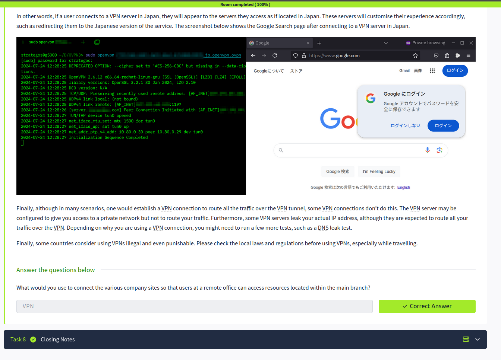

# 🔐 Networking Secure Protocols – Notes

## Introduction
Secure networking protocols protect data during communication across networks. They provide encryption, authentication, and confidentiality to reduce the risk of interception and unauthorized access.

---

## TLS
TLS (Transport Layer Security) is a cryptographic protocol used to secure network communication.

### Functions of TLS
- Encrypts transmitted data  
- Protects confidentiality and integrity  
- Authenticates communicating parties  

- Widely used in secure web browsing and online services  
- Successor to SSL (Secure Sockets Layer)  

---

## HTTPS
HTTPS (HyperText Transfer Protocol Secure) is the secure version of HTTP.

### Features
- Uses TLS encryption  
- Protects data between browser and server  
- Prevents eavesdropping and tampering  

### Common Port
- HTTPS → Port 443  

- Essential for secure websites and online transactions  

---

## SMTPS, POP3S, and IMAPS

### SMTPS
- Secure version of SMTP  
- Encrypts outgoing email communication  
- Common Port → 465  

### POP3S
- Secure version of POP3  
- Encrypts downloaded email communication  
- Common Port → 995  

### IMAPS
- Secure version of IMAP  
- Encrypts synchronized email communication  
- Common Port → 993  

- Secure email protocols protect sensitive communication  

---

## SSH
SSH (Secure Shell) is a secure protocol used for remote system access.

ssh username@IP_address

### Features
- Encrypted remote connection  
- Secure authentication  
- Replaces insecure Telnet  

### Common Port
- SSH → Port 22  

- Widely used in Linux administration and cybersecurity  

---

## SFTP and FTPS

### SFTP (SSH File Transfer Protocol)
- Uses SSH for secure file transfers  
- Encrypts authentication and data transfer  

### FTPS (File Transfer Protocol Secure)
- Adds TLS encryption to FTP  
- Secures traditional FTP communication  

- Both protocols improve file transfer security  

---

## VPN
VPN (Virtual Private Network) creates a secure encrypted tunnel between devices and networks.

### Benefits
- Protects internet traffic  
- Hides user IP address  
- Improves privacy and security  

- Commonly used for remote work and secure browsing  

---

## Key Takeaways
- TLS secures network communication through encryption  
- HTTPS protects web traffic  
- Secure email protocols encrypt email communication  
- SSH provides secure remote access  
- SFTP and FTPS secure file transfers  
- VPNs improve privacy and protect network traffic  

---

## Screenshot

> Screenshot shows completion of Networking Secure Protocols Room on TryHackMe

---

## Next: wireshark basics
