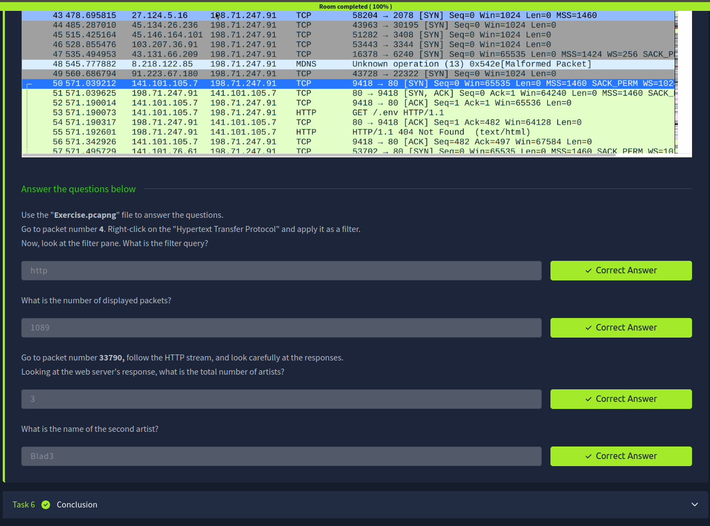

# 🐬 Wireshark Basics – Notes

## Introduction
Wireshark is a network protocol analyzer used to capture and inspect data packets in real time. It is widely used in cybersecurity, network troubleshooting, and traffic analysis.

---

## Tool Overview
Wireshark allows users to:
- Capture live network traffic  
- Analyze packets in detail  
- Identify network issues and suspicious activity  
- Filter and inspect specific protocols  

- It provides a graphical interface for deep packet inspection  

---

## Packet Dissection
Packet dissection is the process of breaking down captured network packets into readable components.

### Packet structure includes:
- Frame information  
- Source and destination IP addresses  
- Protocol type  
- Payload (data)  

- Helps understand how data travels across networks  

---

## Packet Navigation
Wireshark allows navigation through captured packets easily.

### Features:
- Selecting individual packets  
- Viewing packet details in layers  
- Following TCP/UDP streams  

- Helps trace communication between devices step by step  

---

## Packet Filtering
Filtering helps isolate specific traffic from large captures.

### Types of filters:
- Display filters → used after capture  
- Capture filters → used before capture  

### Examples:
- ip.addr == 192.168.1.1  
- tcp.port == 80  
- http  

- Filters make analysis faster and more efficient  

---

## Key Takeaways
- Wireshark is used for network traffic analysis  
- Packets contain structured network communication data  
- Dissection helps break down packet layers  
- Navigation allows detailed inspection of traffic  
- Filters help isolate specific network activity  

---

## Screenshot

> Screenshot shows completion of Wireshark Basics Room on TryHackMe

---

## Next: tcpdump basics
