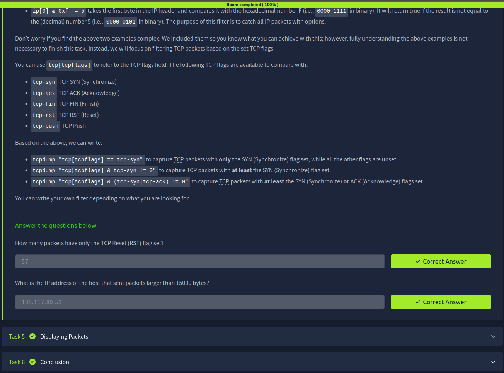

# 📡 TCPDUMP Basics – Notes

## Introduction
tcpdump is a command-line network packet analyzer used to capture and inspect network traffic. It is widely used in cybersecurity, network troubleshooting, and system administration due to its speed and lightweight nature.

---

## Basic Packet Capture
tcpdump allows you to capture packets flowing through a network interface in real time.

### Basic command:
tcpdump

### Capture on a specific interface:
tcpdump -i eth0

- Captures live network traffic  
- Useful for monitoring system communication  
- Requires administrative privileges  

---

## Filtering Expressions
Filtering helps reduce noise by capturing only relevant traffic.

### Examples:
tcpdump host 192.168.1.10  
tcpdump port 80  
tcpdump tcp  

- Filters based on IP, port, or protocol  
- Improves analysis efficiency  

---

## Advanced Filtering
Advanced filters combine multiple conditions for precise packet capture.

### Examples:
tcpdump host 192.168.1.10 and port 443  
tcpdump src 10.0.0.1  
tcpdump dst port 22  

- Uses logical operators (and, or, not)  
- Helps narrow down specific network activity  

---

## Displaying Packets
Captured packets can be displayed in different levels of detail.

### Common options:
tcpdump -n      → disables DNS resolution  
tcpdump -v      → verbose output  
tcpdump -vv     → more detailed output  
tcpdump -c 10   → captures limited number of packets  

- Helps analyze packet content efficiently  
- Useful for debugging and investigations  

---

## Key Takeaways
- tcpdump is a powerful command-line packet analyzer  
- It captures real-time network traffic  
- Filtering reduces unnecessary data  
- Advanced filters allow precise targeting  
- Output options improve readability and analysis  

---

## Screenshot

> Screenshot shows completion of TCPDUMP Basics Room on TryHackMe

---

## Next: Nmap Basics
