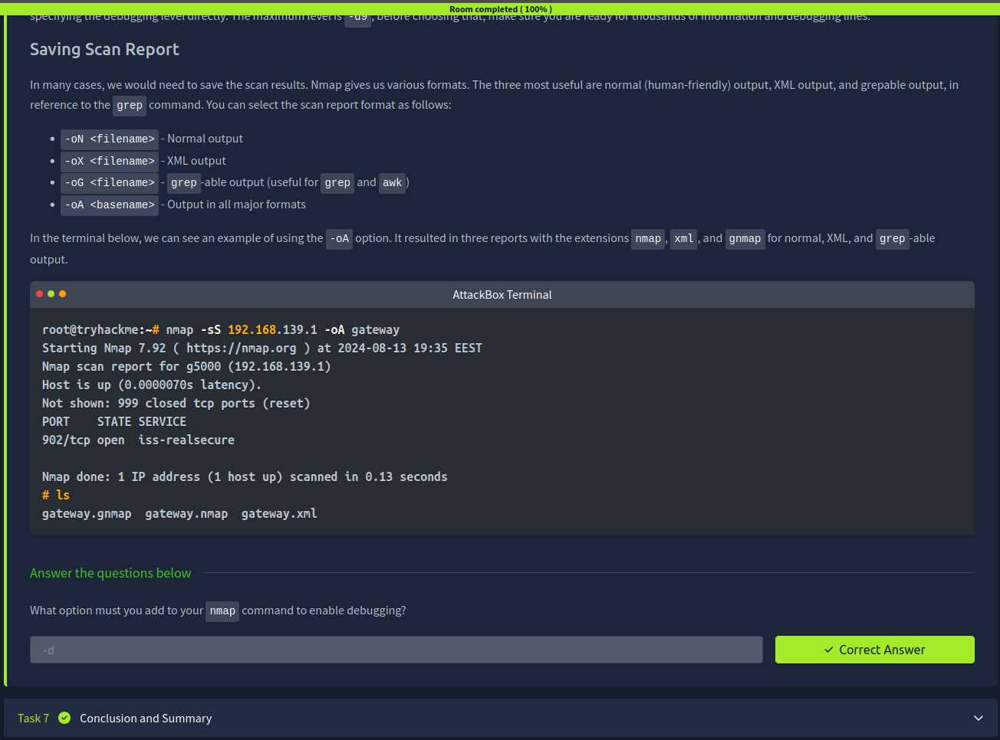

# 🛰️ Nmap Basics – Notes

## Introduction
Nmap (Network Mapper) is a powerful open-source tool used for network discovery and security auditing. It is commonly used in cybersecurity for scanning networks, identifying hosts, and detecting open services.

---

## Host Discovery: Who is Online
Host discovery is used to identify live systems on a network before performing deeper scans.

### Common commands:
nmap -sn 192.168.1.0/24  
nmap 192.168.1.1  

- Identifies active devices on a network  
- Helps map out network infrastructure  
- Also called “ping scan”  

---

## Port Scanning: Who is Listening
Port scanning checks which services are running on a target system.

### Common commands:
nmap -p 80 192.168.1.1  
nmap -p- 192.168.1.1  

- Detects open ports  
- Identifies exposed services  
- Helps find potential entry points  

---

## Version Detection: Extract More Information
Version detection identifies the software and versions running on open ports.

### Command:
nmap -sV 192.168.1.1  

- Reveals service versions  
- Helps identify vulnerabilities  
- Provides deeper insight into target systems  

---

## Timing: How Fast is Fast
Timing controls how quickly Nmap performs scans.

### Timing options:
nmap -T0 → very slow (stealth)  
nmap -T3 → default speed  
nmap -T5 → very fast  

- Faster scans are louder and more detectable  
- Slower scans are more stealthy but take longer  

---

## Output: Controlling What You See
Nmap allows control over how scan results are displayed and saved.

### Output options:
nmap -oN file.txt → normal output  
nmap -oX file.xml → XML output  
nmap -oG file.txt → grepable output  

- Useful for reporting and analysis  
- Helps save scan results for later use  

---

## Key Takeaways
- Nmap is essential for network reconnaissance  
- Host discovery identifies live systems  
- Port scanning reveals open services  
- Version detection provides deeper system insight  
- Timing controls scan speed and stealth  
- Output options help store and analyze results  

---

## Screenshot

> Screenshot shows completion of Nmap Basics Room on TryHackMe  

---

## Conclusion & Summary
Nmap is one of the most important tools in cybersecurity. It allows attackers and defenders to understand network structure, identify services, and discover vulnerabilities. Mastering Nmap is essential for penetration testing and network security analysis.
