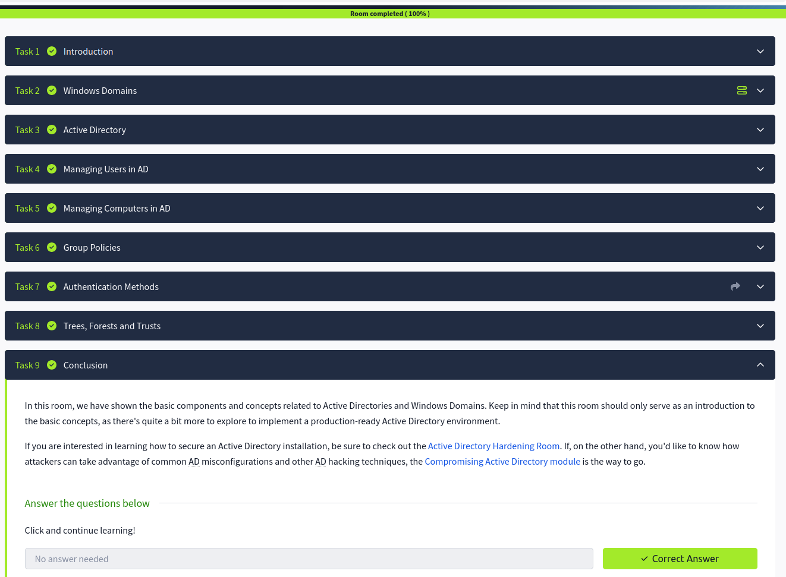

# Active Directory Basics

## Overview

This room introduces Active Directory (AD) concepts and management in Windows environments.  
The goal is to understand AD structure, user and computer management, group policies, authentication methods, and trust relationships in enterprise networks.

## 1. Introduction to Active Directory

- AD is a directory service used in Windows domain networks  
- Centralized management of users, computers, and resources  
- Provides authentication and authorization services  

## 2. Windows Domain

- A domain is a logical grouping of computers and users  
- Managed by a Domain Controller (DC)  
- Provides centralized login and resource access  

## 3. Active Directory Structure

- Organizational Units (OUs) organize users, groups, and computers  
- Domains contain OUs, which are used to apply policies and permissions  
- Trees and forests allow multiple domains to be linked  

## 4. Managing Users in AD

- Create, modify, and delete user accounts  
- Assign users to groups for permissions management  
- Enforce password policies and account restrictions  

## 5. Managing Computers in AD

- Add computers to the domain  
- Organize computers into OUs  
- Apply policies to groups of computers  

## 6. Group Policies

- Centralized configuration for users and computers  
- Can enforce security settings, software installations, and scripts  
- Applied at domain, OU, or site level  

## 7. Authentication Methods

- Kerberos: primary authentication protocol for Windows domains  
- NTLM: older fallback authentication method  
- Single Sign-On (SSO) for seamless access to multiple resources  

## 8. Tree, Forest, and Trust

- Tree: a collection of domains in a contiguous namespace  
- Forest: a collection of trees sharing a global catalog  
- Trust relationships allow users in one domain to access resources in another  

## 9. Conclusion

- Active Directory is essential for enterprise management  
- Proper user, computer, and group policy management improves security  
- Understanding AD structure, authentication, and trusts is foundational for cybersecurity  

## 10. Screenshot

## Key Security Insights

- Misconfigured AD permissions can lead to privilege escalation  
- Group Policies enforce security consistently across multiple machines  
- Trust relationships must be managed carefully to prevent unauthorized access  
- Monitoring and auditing AD activities is critical for security compliance  

## What I Learned

- Core concepts of Active Directory  
- How to manage users and computers in a domain  
- Apply and manage Group Policies  
- Understand authentication methods in Windows domains  
- The structure of trees, forests, and trust relationships  
- Security best practices for AD environments
