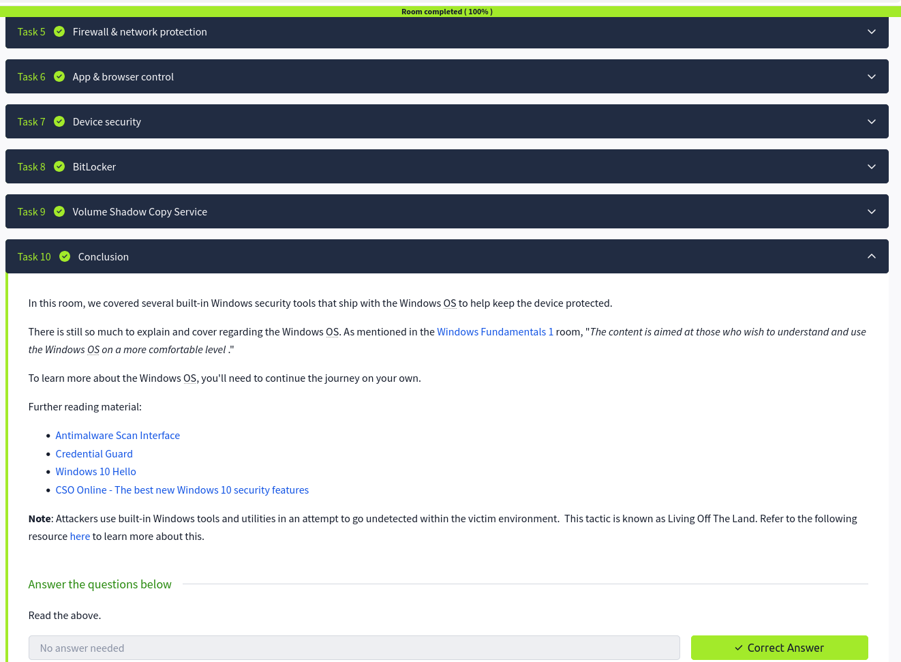

# Windows Fundamentals 3

## Overview

This room focuses on Windows security and system protection features.  
The goal is to understand built-in security tools, update management, and encryption services to maintain a safe Windows environment.

## 1. Windows Updates

- Ensures the system has the latest security patches  
- Configure automatic updates in Settings → Update & Security  
- Check update history for applied updates  
- Important for protecting against vulnerabilities

## 2. Windows Security

Central hub for system protection. Provides access to:

- Virus & threat protection  
- Firewall & network protection  
- App & browser control  
- Device security  
- Account protection  
- Device performance & health  

## 3. Virus & Threat Protection

- Built-in Windows Defender Antivirus  
- Run quick/full scans  
- Review protection history  
- Configure real-time protection  

## 4. Firewall & Network Protection

- Windows Defender Firewall monitors inbound/outbound traffic  
- Configure rules for apps and ports  
- Monitor network profiles: Domain, Private, Public  

## 5. Apps & Browser Control

- Protects against malicious websites and downloads  
- SmartScreen Filter for Edge browser  
- Configure Exploit Protection settings  

## 6. Device Security

- Ensures hardware security features are enabled  
- Core Isolation and Secure Boot  
- Protects against firmware-level attacks  

## 7. BitLocker

- Full disk encryption for protecting sensitive data  
- Can encrypt internal drives and removable drives  
- Requires TPM or password for access  

## 8. Volume Shadow Copy Service (VSS)

- Allows backups and restore points  
- Useful for recovering from accidental deletions or ransomware  
- Works with File History and system restore points  

## 9. Key Security Insights

- Keeping Windows updated prevents exploitation of known vulnerabilities  
- Windows Defender and Firewall provide basic protection by default  
- BitLocker protects sensitive data from physical theft  
- Volume Shadow Copy provides recovery options if data is lost or encrypted by malware  

## 10. Screenshot

## What I Learned

- How to manage Windows updates and patches  
- Configure and monitor Windows Defender Antivirus  
- Set up firewall and network protection  
- Enable and use App & Browser Control  
- Understand device security settings  
- Enable BitLocker encryption  
- Use Volume Shadow Copy Service for backups and recovery
